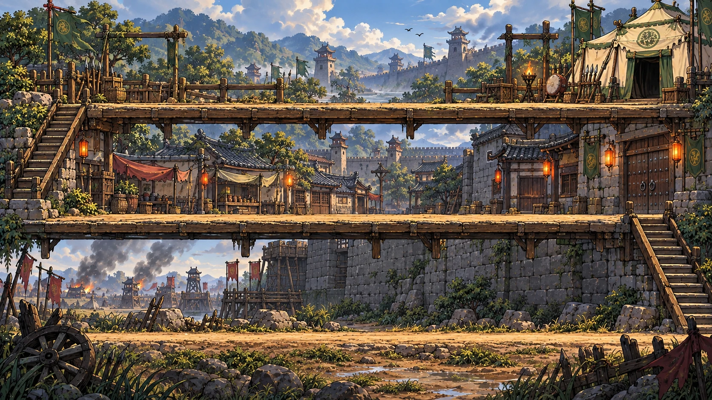

# 新野 · 美术资源与动画清单

更新日期：2026-09-17。对应本项目《游戏策划案》中的单关内容：刘备、12 张卡牌、7 类敌军。玩法统一在策划案维护，本表负责美术制作和资源交接。

人物规范已于本轮更新：14 个角色统一使用整身关键帧，包含刘备、曹军七兵种、蜀军守卫和军医、舞女、关羽、张飞、诸葛亮。正式人物原图在 `art/source/characters/<编号>/poses.png`，压缩图集在 `assets/game/characters/`，动作及生成记录以 `art/character-frames.json` 和 `tools/whole-character-art.mjs` 为准。下文旧人物拆件、腿部裁切和手臂拼接条目属于早期方案，已停止使用；不应据此恢复旧角色。三位英雄已完成美术与动作，未新增本关卡牌。

## 1. 背景首图

| 项目 | 交付 |
| --- | --- |
| 上层 | 刘备营地，右端主帐，露天木台、军旗和山野远景 |
| 中层 | 城内露天街道，瓦屋、摊棚，右侧城门 |
| 下层 | 城外土路，城墙外立面、远处曹军营地 |
| 连接 | 右侧楼梯连接城外和城内；左侧楼梯连接城内和营地 |
| 使用图 | `assets/game/camp-city-outskirts-v1.webp`，1672 × 941，642,574 字节 |
| 原图 | `art/source/camp-city-outskirts-v1.png`，3,256,058 字节 |
| 压缩 | 不缩小尺寸，WebP 品质 90；体积减少 80.27% |
| 生成记录 | `art/background-generation.json`，包含参考图、提示词和内置 image_gen 生成来源 |

这是场景首图，已确定构图和风格。画面不含角色、机关、文字和界面。接入战斗前还需制作下表的场景分层与交互部件；首图不是已完成碰撞、遮挡和动画的游戏地图。

## 2. 已复制到本项目的资源

来源：`D:/zhugongkuaipao/assets/game`。下列 17 张图片均已复制到 `D:/Tower/assets/game`，保留源 WebP 的透明通道与压缩，不再重复有损转码。图集内含一些本关未使用的图案，保留图集不代表新增玩法。

图格编号从 0 开始，按从左到右、从上到下排列。精确裁切坐标与用途映射见 `assets/game/asset-manifest.json`。

| 文件 | 布局 / 尺寸 | 本关可用内容 | 使用边界 |
| --- | --- | --- | --- |
| `actors-v2.webp` | 4 × 2；每格 512 | 格 0 刘备形象；格 5 曹军步卒；格 6 盾兵 | 刘备是跑动立绘，需补驻守；盾兵须拆出盾牌及被盾遮住的身体 |
| `shu-infantry-v1.webp` | 2 × 2；每格 512 | 格 1 刀盾亲卫 | 已有静态造型，动作另做 |
| `shu-devices-v3.webp` | 3 × 1；每格 384 | 格 0 连弩车 | 弩臂、弦、箭和车体要拆件 |
| `props.webp` | 3 × 1；每格 256 | 格 0 拒马；格 1 滚木；格 2 火盆 | 滚木是弹体，不是完整的滚木发射架 |
| `cao-commanders-v1.webp` | 2 × 1；每格 512 | 格 0 曹洪 | 已有静态造型，携带和攻击另做 |
| `cao-troops-v3.webp` | 4 × 2；每格 512 | 格 1 敌军弓手；格 0 可作斥候服装参考 | 格 0 是扛梯兵，不能直接当作倒挂攀顶动作；格 7 双人抬杆也不能代替单人携带 |
| `liubei-poses-v1.webp` | 2 × 2；每格 512 | 格 0 挣扎；格 3 蹲伏 / 呼救姿态 | 不同姿态是静态图，不是连续动画帧 |
| `mechanism-states-v1.webp` | 4 × 3；每格 512 | 格 2、3 木料状态；格 6 军旗；格 7 绞盘；格 10 碎木 | 绞盘只可作钩爪组件；格 1 是水闸，不是地板翻板 |
| `effects-v1.webp` | 4 × 2；每格 512 | 格 0—2 火焰循环；格 4 水花参考；格 5 铜钱；格 7 冲击 / 解救光圈底图 | 火焰有三张循环帧；其余多为独立静态效果，毒液、寒风和治疗仍需对应图形 |
| `gate-door-left-v1.webp` | 256 × 512 | 左门扇 | 要与新背景城门透视、尺寸对齐 |
| `gate-door-right-v1.webp` | 256 × 512 | 右门扇 | 需补门洞内景，不能叠在原图闭门上直接开门 |
| `camp-card-v1.webp` | 247 × 394 | 空白卡牌底框 | 卡图、名字、价格和冷却由界面组合 |
| `camp-paper-v1.webp` | 434 × 399 | 空白卷纸弹窗 | 选卡、暂停、结算通用底板 |
| `camp-gold-v1.webp` | 450 × 142 | 金色按钮底图 | 动态排字 |
| `camp-ivory-v1.webp` | 434 × 131 | 浅色按钮底图 | 动态排字 |
| `camp-coin-v1.webp` | 80 × 80 | 军饷图标 | 可直接使用 |
| `camp-back-v1.webp` | 96 × 93 | 返回按钮图标 | 可直接使用 |

另复制 `rigs.json` 为 `assets/game/actors-rigs.json`：原项目刘备、步卒、盾兵的腿部裁切参考。原项目利用这些分件做程序步态；本项目尚未移植动画播放器。它不是完整的骨骼动画或序列帧交付。

未纳入本关使用图：旧关卡背景、其他地图、曹操和骑马剧情素材、局外营地首页，以及旧结算整图。旧胜利图已把关名、逃脱文案、奖励与成绩写进画面，不能作为本关结算页面。单独的 `liubei-crouch-v1.webp` 带明显矩形底色，不能直接用作透明战斗角色，已有蹲伏图优先用姿势图集。

## 3. 角色与机关补图单

共 20 个战斗主体：7 个已有可复用静态造型，4 个已有部分素材需改绘，9 个需新增主体图。静态造型可用不代表动画已完成。每一行都要完成第 5 节列出的动作。

| 策划编号 | 名称 | 当前情况 | 还需要的美术 |
| --- | --- | --- | --- |
| L01 | 刘备 | 部分可用 | 主帐前驻守姿势；被扛时可挂接的身体、手臂和衣摆；落地、蹲伏起身、回位、庆祝动作所需分件。保持现有脸型和绿衣 |
| G01 | 地刺 | 新增 | 嵌地木框、收起尖刺、伸出尖刺、损坏木框；尖刺与底座分开 |
| G02 | 连弩车 | 静态可用 | 弩身、可转向弩臂、弓弦、箭、发射亮点、损坏件；保留现有整机造型 |
| G03 | 悬毒壶 | 新增 | 悬挂支架、吊绳、壶身、壶嘴、液滴、绿色毒液溅洒；要能看出向下攻击 |
| G04 | 军需账房 | 新增 | 一格宽军需柜台，账簿、钱袋、储钱槽和损坏状态；不使用一整个营帐遮住通道 |
| G05 | 寒风机关 | 新增 | 挂墙风箱、风轮、出风口、冷风纹理、停用状态；轮廓与弩车明确区分 |
| G06 | 拒马 | 静态可用 | 受损木刺、主体裂纹、破碎木块；不需要为每档耐久另画整套立绘 |
| G07 | 翻板 | 新增 | 闭合板、铰链、左右 / 单侧开板件、敞开洞口、底缘遮挡、下层穿出遮罩；与背景栈道板同材质 |
| G08 | 破甲钩爪 | 部分可用 | 利用绞盘造型补完整吊架、朝下钩爪、可延长铁链、收回状态；钩爪可夹住独立盾牌 |
| M01 | 悬锤 | 新增 | 顶部吊座、链条、锤头、起落机构、碎屑；锤头能独立沿竖向运动 |
| M02 | 滚木架 | 部分可用 | 已有滚木弹体；补固定发射架、待发滚木、释放挡销、空架和装填木料；左右朝向一致 |
| S01 | 刀盾亲卫 | 静态可用 | 刀、盾、左右手臂和腿拆件，补挡盾后躯干、挥砍与倒地姿势 |
| S02 | 军医匠 | 新增 | 绿军装医匠，药箱与小工具袋；治疗手势、维修工具和独立手臂；与战斗步兵轮廓区分 |
| E01 | 曹军步卒 | 静态可用 | 在原腿部分件基础上补挥刀、伸手抓人、扛人手臂、倒地姿势 |
| E02 | 盾兵 | 静态可用 | 可独立脱落的盾牌、持盾手臂、完整无盾躯干、抓人 / 携带姿势；失盾后不能还把盾画在身上 |
| E03 | 破械工兵 | 新增 | 曹军配色、工具背包、明显拆械锤 / 撬棍；敲击手臂与抓人手臂分开 |
| E04 | 飞檐斥候 | 部分可用 | 参考扛梯兵配色重画轻装斥候；倒挂躯干、交替抓梁手臂、收腿、落地与普通步行姿势，不带大梯子 |
| E05 | 敌军弓手 | 静态可用 | 弓、弦、箭、左右手臂分开；拉弓 / 放箭、收弓、抓人和携带姿势 |
| E06 | 重甲虎卫 | 新增 | 双手重兵器、厚甲、宽体形，避免与圆盾兵混淆；慢行、重击、抓人、携带、倒地分件 |
| E07 | 曹洪 | 静态可用 | 保留现有金甲、红盔辨识；补刀臂、抓取与携带手臂、受击和倒地分件 |

L01 仅是美术对刘备的索引，不新增卡牌。角色左右转向优先镜像；文字、军旗标记和不对称持盾关系需要单独处理。

## 4. 场景、特效与界面补图单

| 编号 | 补图组 | 具体交付 | 必要性 |
| --- | --- | --- | --- |
| B01 | 背景分层与补底 | 从已渲染首图整理远景、各层后景、两层木台、底层道路、前景遮挡；补原木板、门扇移除后露出的背景 | 翻板、开门、角色穿行时不能露出旧图或空白 |
| B02 | 露天安装支撑 | 顶层连续高棚梁、可拼接矮木围挡；中下层底梁与局部墙面补片；完整 / 断端部件 | 地面、墙面、顶部挂点都要有可见实体；顶层中央当前缺连续挂梁，不在天空中悬空放机关 |
| B03 | 三个出入口 | A 城外路口撤离旗与边界；B 城门门洞内景、适配后的双门扇；C 上层左侧外援栈道与开闭挡栏 | C 口从画面外引入援军，不能把城内通往上层的楼梯误当作新兵出生点 |
| B04 | 栈道活动模块 | 可替换的一格宽地板、洞口后底、前沿遮挡、落层出口遮罩 | 第二、三层翻板都能露出下方通道；最低层不需要落洞图 |
| B05 | 主帐前保护区 | 刘备驻守落点、营帐门帘拆件、可选中旗与灯火拆件 | 驻守点与营帐保持清楚联系；门帘、旗帜若做动画需先清掉底图里的静态重影 |
| F01 | 物理战斗效果 | 弩箭 / 弓箭、命中闪光、挡箭火花、盾牌脱落碎片、锤击尘圈、滚木扬尘 | 明确命中方向、盾牌格挡与击退 |
| F02 | 毒与寒风 | 毒滴、毒溅、简洁中毒标记；冷风短纹、减速脚底圈 | 毒液与普通水花可区分；寒风不遮挡角色身份 |
| F03 | 治疗与维修 | 治疗微光、工具敲击亮点、维修小碎屑；可复用一套基础粒子 | 区分修复对象与攻击目标 |
| F04 | 抓捕与救援 | 抓取标记、被抓警报、刘备脚下待救圈、回营拖尾 / 收束光、护驾屏障和破裂碎片 | 护盾独立于刘备显示；救下后必须看得清刘备在哪里 |
| U01 | 卡牌图标 | 12 个；由完成后的机关 / 守军主体裁切得到，放入已复制卡框 | 不另画 12 张与战斗造型不一致的大插画 |
| U02 | 应急与状态图标 | 护驾、回营、金印、护甲、盾牌、抓取、待救、三类安装面 | 不把血量盾、护甲与无血量的刘备混成同一标记 |
| U03 | 通用界面部件 | 波次与军饷栏、入口警示底条；暂停 / 胜利 / 失败面板排版 | 使用现有空白卷纸和按钮；所有标题、成绩、费用动态排字 |

选中轮廓、格子高亮、射程、冷却扇形、读条、数字、箭头与血条由界面绘制，不要求美术为每种数值导出图片。B05 的旗帜 / 门帘氛围动画可以排在战斗闭环之后；B01—B04 和抓捕、解救所需画面优先完成。

## 5. 动画清单

以下是本关需要完成的动作列表。已有程序步态和静态姿势可作为起点，除火焰三帧外，不把一张图的平移、旋转或整幅抖动算作完整角色动画。

### 5.1 角色动画

| 对象 | 必需动作 | 美术与程序分工 |
| --- | --- | --- |
| 刘备 | 驻守呼吸；被抓起；被扛挣扎循环；落地；蹲伏呼救；起身；回营；胜利松气 | 身体、手臂和衣摆需补图；回营路径、透明变化和保护提示可由程序组合。被扛与落地都有独立挂接点 |
| 曹军步卒 | 站立、行走、上 / 下楼梯、挥刀、受击、抓取、携带行走、携带过楼梯、携带受击、死亡 | 原图腿部分件可复用；挥刀、抓取与携带手臂需补。携带者死亡时刘备独立落地 |
| 盾兵 | 上述通用动作；举盾格挡、盾被打碎、被钩走盾、无盾行动与攻击 | 盾牌独立层；失盾后所有动作使用无盾版本，可共享身体动作 |
| 破械工兵 | 通用移动、受击、抓取、携带和死亡；敲击拆械；对守军的近身攻击 | 工具动作有接触点，不能用挥刀代替敲击 |
| 飞檐斥候 | 地面移动；攀顶抓梁循环；短跳换层；松手下落；落地收身；抓取；携带步行 / 过楼梯；受击与死亡 | 攀顶需要独立手脚姿态，不能将步行图倒转；携带时恢复地面动作，不能继续挂梁 |
| 敌军弓手 | 通用移动、抓取、携带、受击、死亡；抬弓、拉弦、放箭、收弓 | 箭从弓弦位置产生；携带时武器收起，避免手臂同时拉弓和抓人 |
| 重甲虎卫 | 慢行 / 楼梯、明显预摇、重击、受击、抓取、携带、倒地 | 重击有独立手臂与兵器动作，不能只放大普通步兵 |
| 曹洪 | 站立、行走 / 楼梯、重刀预摇与劈砍、受击、抓取、携带、倒地 | 使用现有造型；武器与携带挂接层独立 |
| 刀盾亲卫 | 待命、行走、迎敌、挥砍、举盾、受击、倒地、部署 / 撤回 | 不能把敌军红衣改色即当作全部动作；使用已有蜀军主体 |
| 军医匠 | 待命、行走、施药、维修、给自己治疗、受击、倒地、部署 / 撤回 | 施药与维修共用身体，但手势和工具效果要区分 |

所有地面敌人补“被翻板送下层”的失衡 / 下落姿态，可复用受击分件并由程序控制位移。携带落层时刘备始终附着；角色死亡与刘备落地各播各的动作，不能把两者烘成一张不可拆的图片。盾兵持盾、失盾与携带的组合要保持盾状态一致。

### 5.2 机关动画

| 编号 | 动作 | 需要拆开的内容 |
| --- | --- | --- |
| G01 地刺 | 待机收起 → 刺出 → 停留 → 收回；受击、摧毁 | 底框、尖刺、碎片 |
| G02 连弩车 | 转向 / 瞄准、弦绷紧、射击后坐、复位、受击、摧毁 | 弩臂、弦、箭、车体 |
| G03 悬毒壶 | 液滴形成、滴落、壶轻摆、命中溅毒、破碎 | 支架、壶、液滴、溅洒 |
| G04 军需账房 | 生产提示、钱袋出现、待收、收取、受击、摧毁 | 柜台、钱袋和可动标识；钱袋数量由程序显示 |
| G05 寒风机关 | 风轮转动、持续出风、停用、受击、摧毁 | 风轮与机壳分离，风纹单独循环 |
| G06 拒马 | 被击晃动、耐久受损、破碎消失 | 完整主体、裂纹、木片；晃动可由程序完成 |
| G07 翻板 | 锁定目标、打开、目标跌落、关闭、冷却复位、摧毁 | 活动板、洞口、前后遮挡，动作不把整条通道一起擦掉 |
| G08 破甲钩爪 | 瞄准、链条伸出、钩爪闭合、剥盾、收回、待机、摧毁 | 吊架、链条、钩爪、被抓住的独立盾牌 |
| M01 悬锤 | 装填拉升、就绪、预摇、下砸、撞击、回收、摧毁 | 吊座、链条、锤头、地面尘圈；攀顶目标处于锤头扫过范围 |
| M02 滚木架 | 装填、就绪、挡销释放、滚木滚动、落层、架体受击 / 摧毁 | 发射架、挡销、待发滚木、运动滚木、碎片；弹体离架后独立播放 |

建造进入、拆除淡出、受击闪色、冷却显示可由程序实现。可旋转的木轮、锤头下落、链条伸缩使用分件即可，不要求绘制几十张重复整图。

### 5.3 场景、效果与界面动画

| 对象 | 动作 | 现有起点 |
| --- | --- | --- |
| B 口城门 | 预警 → 门扇开启 → 敌人进入 | 已有左右门扇；需适配新门洞与后底 |
| C 口栈道 | 预警 → 挡栏开放 → 援军进入 | 需新增栈道端部和可动挡栏；不要临时在刘备身旁刷人 |
| 旗帜、门帘、火盆 | 小幅循环摆动、火焰循环 | 火焰已有 3 帧；旗帜和门帘须先拆层，属氛围补充 |
| 钱袋 / 铜钱 | 出现、轻浮动、收取飞向军饷栏 | 已有铜钱；钱袋由账房组件补齐 |
| 伤害与状态 | 箭飞行、命中、挡盾、剥盾、毒滴、毒溅、寒风、治疗、维修、眩晕 | 部分光圈和碎木可复用，其余按 F01—F03 补基础形状 |
| 抓捕 / 解救 / 护驾 | 抓取读条、被抓警报、待救保护圈、回营、护盾出现 / 受击 / 破碎 | 光圈可复用；主公状态图标、屏障分件仍需新增 |
| 界面 | 卡牌部署冷却、手动装填、入口倒计时、金印出现、结算弹出 | 空白底框已存在；数字、遮罩与缓动由程序完成 |

## 6. 美术交付方式

- 风格跟随已确认参考：粗黑描边、夸张三国人物、木石与布料质感。兵器、机关功能和敌我阵营在缩到游戏尺寸后仍可识别。
- 背景保留原图并导出压缩 WebP；活动部件、角色、机关、效果使用透明 PNG 源件和 WebP 游戏图。禁止把棋盘格或底色烘进“透明”图。
- 新角色以 512 × 512 的动作画布为基准；地面角色用统一脚底锚点，攀顶角色另有抓梁锚点，刘备另有被携带挂点。原图集的不同锚点在资源映射中转换，不靠每个动作临时猜位置。
- 分件优先：角色的头、躯干、前后臂、前后腿、兵器和盾；机关的底座与运动部件。拆开后要补齐原来被遮挡的身体或背景。
- 必须重画姿势的动作可交序列帧，优先 6—8 张关键帧再按游戏尺寸检查流畅度；不要把同一动作每帧裁成不同尺寸。只需程序平移、旋转的部件不额外画重复帧。
- 交付动作同时标注落脚、发射、命中、抓取完成、释放主公等事件点；具体动作时长读取《游戏策划案》，不在美术文件里再定义伤害、冷却或抓捕判定。
- 源件按对象编号组织，如 `G07` 翻板、`E04` 斥候；文件与裁切信息统一进入 `asset-manifest.json`。费用、伤害、出生编组等玩法数据不放进此清单或图集。

建议制作顺序：先补场景支撑 / 洞口、刘备与所有敌人的抓取携带动作，再补完整机关和军医匠，随后完成其他战斗动作、效果与界面，最后补氛围循环。

## 7. 文件交付

| 内容 | 路径 |
| --- | --- |
| 唯一玩法策划 | `游戏策划案.md` |
| 本清单 | `美术清单.md` |
| 已复制素材、压缩背景、裁切映射 | `assets/game/` |
| 背景原图与生成记录 | `art/` |
| 压缩包 | `deliverables/新野-策划与美术.zip` |

压缩包包含上述两份文档、所有已复制素材、压缩背景、原图与生成记录。源项目文件保持不变。本次完成资源复用准备、背景首图和制作清单；表中的“新增”“改绘”和动作需求尚待制作，未标记为已交付动画。
